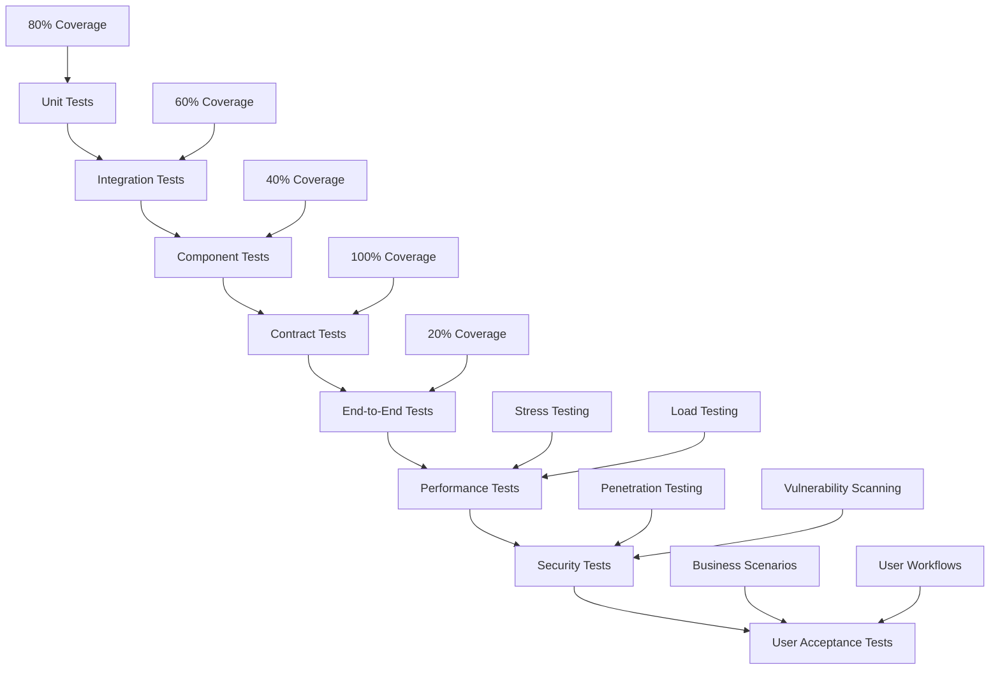

# Testing & Deployment Documentation

## Comprehensive Testing Strategy

This document outlines the comprehensive testing strategy for the Target Acquisition & Engagement AI system, covering all testing levels, methodologies, and quality assurance procedures.

## 1. Testing Architecture

### Testing Pyramid

### Testing Infrastructure
**Tooling**:
- Backend (Node.js): Jest or Vitest
- Backend (Python): PyTest + Hypothesis (property-based testing)
- Frontend: Vitest/Jest + Testing Library + Playwright for E2E
- Contract Testing: Pact (consumer/provider)
- Performance: k6
- Security: Semgrep/CodeQL (SAST), OWASP ZAP (DAST), gitleaks (secrets)

**Environments**:
- `dev`: local with Docker Compose; ephemeral MongoDB/Redis
- `ci`: containerized services; seeded test databases
- `staging`: mirrors production with test data; smoke + load tests
- `prod`: canary + blue/green deployments with automated smoke

## 2. Unit Testing

### Backend Unit Tests
**Scope**:
- Pure functions, utility modules, repository adapters, RBAC and permission checks

**Standards**:
- Coverage: ≥80% lines/branches; no skipped tests in default suite
- Deterministic: avoid external calls; mock I/O and network

**Examples**:
- Auth token issuance/validation; rate limiting counters; error mappers

### Frontend Unit Tests
**Scope**:
- UI components, hooks, state stores, reducers, selectors

**Standards**:
- Coverage ≥70%; accessibility assertions where applicable
- Snapshot tests only for stable presentational components

## 3. Integration Testing
**Scope**:
- Service integration: API → database, cache, queue, external providers (mocked/sandboxed)

**Patterns**:
- Spin up MongoDB/Redis via Docker Compose
- Use sandbox credentials for OAuth providers where available; otherwise mock
- Seed fixtures; isolate per-suite databases with unique prefixes

**Contract Testing**:
- Define Pact contracts between frontend client and API
- Define provider contracts between API and AI/automation services

## 4. End-to-End Testing
**Scope**:
- User journeys: onboarding, campaign creation, acquisition run, review, message approval, delivery, tracking

**Tools**:
- Playwright: run in headless mode with realistic viewport and network conditions

**Data**:
- Synthetic profiles; sandbox APIs; stub automation when testing delivery

**Stability**:
- Auto-retry flaky tests with capped attempts; collect traces/videos on failure

## 5. Performance Testing
**Scope**:
- API throughput, acquisition batch processing, message delivery queueing, analytics aggregation

**SLOs**:
- Dashboard interactions p95 < 2s; API p95 < 300ms for common endpoints
- Acquisition throughput ≥100 profiles/hour baseline

**Scenarios (k6)**:
- Steady load, spike tests, soak tests (≥2h), and failover simulations

**Resources**:
- Isolated environment; monitor CPU/mem/IO; collect Prometheus metrics

## 6. Security Testing

**Static Analysis (SAST)**:
- Semgrep/CodeQL runs on PR; block on high severity findings

**Dynamic Analysis (DAST)**:
- OWASP ZAP baseline scan against staging; authenticated routes tested via recorded sessions

**Dependency & Secrets**:
- Dependency scanning each build; gitleaks in CI; block secrets in commits

**Penetration Testing**:
- Scheduled quarterly; scope includes auth, RBAC bypass attempts, rate limit evasion

## 7. Deployment & Operations

**CI/CD Pipeline**:
- Steps: lint → typecheck → unit → integration → contract → build → E2E (on staging) → security → deploy
- Gates: coverage thresholds, vulnerability thresholds, E2E success, manual approval for production deploys

**Environments**:
- Staging: blue/green with synthetic and anonymized data; smoke test on activation
- Production: canary release (10%) then full rollout; automatic rollback on SLO breach

**Health & Observability**:
- Readiness/liveness probes; distributed tracing; structured logs with correlation IDs
- Alerting: p95 latency, error rate, queue lag, session degradation

**Data Migrations**:
- Versioned migrations; backward-compatible releases; pre-deploy validation; post-deploy verification

## 8. Test Data Management

**Fixtures**:
- Deterministic, minimal, reusable; seeded via scripts; isolated per test

**Synthetic Data**:
- Generated profiles/messages aligning with schema; no real PII

**Anonymization**:
- For staging mirrors, anonymize sensitive fields; ensure referential integrity

**Reset Policy**:
- Full environment reset between test suites in CI; daily resets in staging

