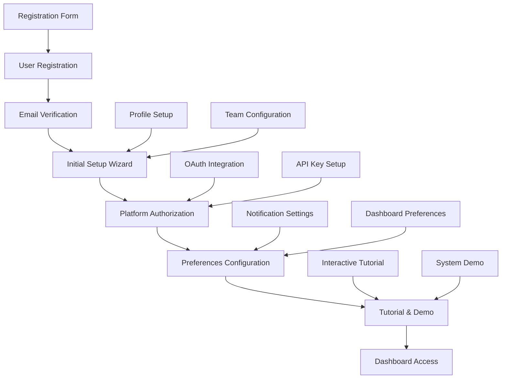
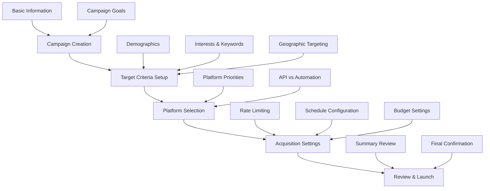
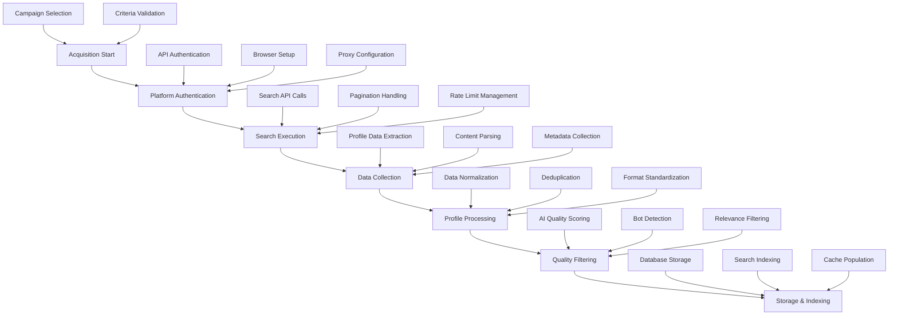
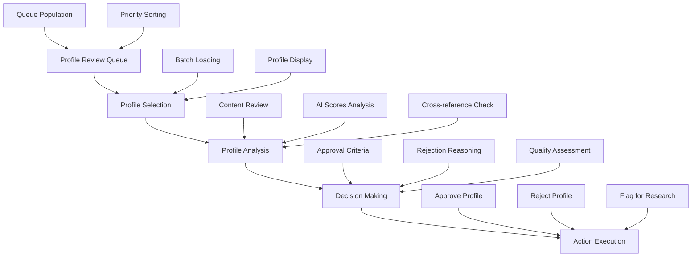
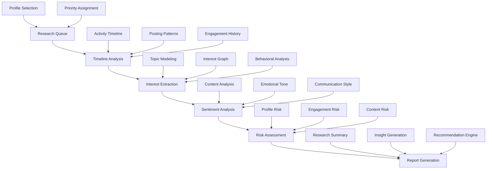
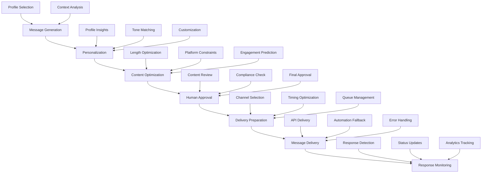
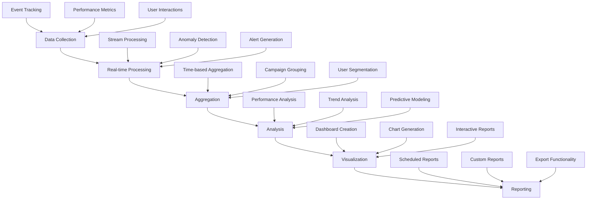
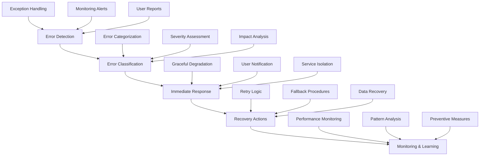
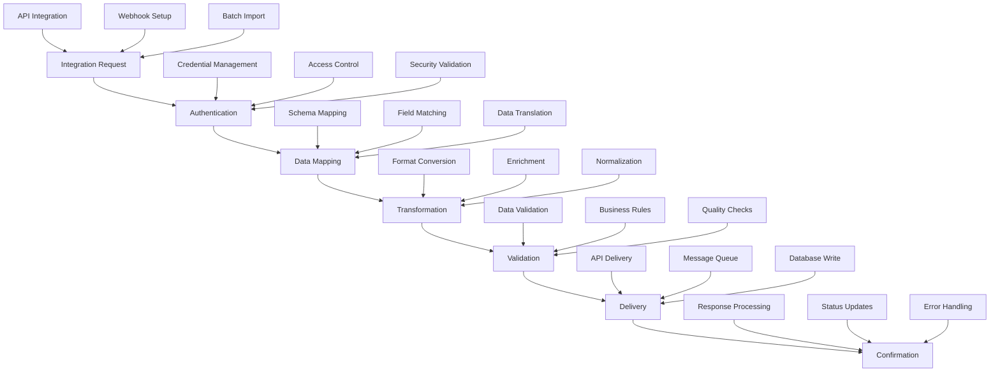
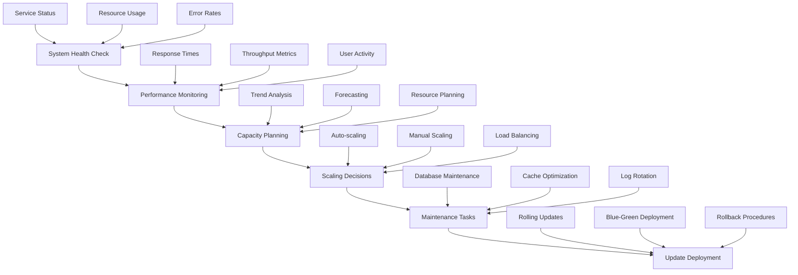

# Workflow Diagrams & Process Specifications

## System Workflow Overview

This document provides detailed workflow diagrams and process specifications for the Target Acquisition & Engagement AI system. These diagrams illustrate the end-to-end processes, user interactions, and system component interactions.

## 1. User Onboarding Workflow

### Process Description
New users go through a comprehensive onboarding process to set up their account, configure preferences, and understand system capabilities.

### Process Specifications

#### Step 1: User Registration
- **Input**: Email, username, password, basic profile information
- **Validation**: Email format, password strength, username uniqueness
- **Output**: User account created, verification email sent
- **Duration**: < 2 minutes
- **Error Handling**: Duplicate email/username handling, validation feedback

#### Step 2: Email Verification
- **Input**: Verification token from email
- **Process**: Token validation, account activation
- **Output**: Verified user account
- **Duration**: < 1 minute
- **Error Handling**: Expired token handling, resend verification

#### Step 3: Initial Setup Wizard
- **Input**: User preferences and configuration
- **Process**: Guided setup with progressive disclosure
- **Output**: Configured user profile and preferences
- **Duration**: 5-10 minutes
- **Error Handling**: Skip options, save progress

## 2. Campaign Creation Workflow

### Process Description
Users create targeted acquisition campaigns with specific criteria and objectives.

### Process Specifications

#### Step 1: Campaign Creation
- **Input**: Campaign name, description, objectives
- **Validation**: Required fields, character limits
- **Output**: Campaign record created
- **Duration**: < 1 minute

#### Step 2: Target Criteria Setup
- **Input**: Demographics, interests, keywords, locations
- **Process**: Guided setup for defining the target audience.
- **Output**: Structured targeting criteria
- **Duration**: 3-5 minutes

#### Step 3: Platform Selection
- **Input**: Platform preferences, authentication methods
- **Process**: Manual selection of target platforms.
- **Output**: Platform configuration
- **Duration**: 2-3 minutes

#### Step 4: Acquisition Settings
- **Input**: Rate limits, scheduling, budget constraints
- **Process**: Manual configuration of operational parameters.
- **Output**: Operational parameters
- **Duration**: 2-3 minutes

## 3. Profile Acquisition Workflow

### Process Description
The core acquisition process handles multi-platform profile collection with intelligent filtering.

### Process Specifications

#### Phase 1: Platform Authentication
- **Input**: Platform credentials, proxy settings
- **Process**: OAuth flows, session management, proxy rotation
- **Output**: Authenticated sessions
- **Duration**: 30 seconds - 2 minutes per platform
- **Error Handling**: Retry logic, fallback authentication

#### Phase 2: Search Execution
- **Input**: Search criteria, platform-specific parameters
- **Process**: API calls, pagination, rate limiting
- **Output**: Raw profile data
- **Duration**: Variable based on search volume
- **Features**: Parallel processing, progress tracking

#### Phase 3: Data Collection
- **Input**: Raw profile identifiers
- **Process**: Profile detail fetching, content extraction
- **Output**: Complete profile objects
- **Duration**: Variable based on profile count
- **Features**: Batch processing, error recovery

#### Phase 4: Profile Processing
- **Input**: Raw profile data
- **Process**: Normalization, deduplication, standardization
- **Output**: Processed profile objects
- **Duration**: < 1 second per profile
- **Features**: Parallel processing, data validation

#### Phase 5: Quality Filtering
- **Input**: Processed profiles
- **Process**: AI scoring, bot detection, relevance filtering
- **Output**: Quality-filtered profiles
- **Duration**: < 500ms per profile

## 4. Human Review Workflow

### Process Description
Human operators review AI-filtered profiles to ensure quality and relevance.

### Process Specifications

#### Queue Management
- **Input**: AI-filtered profiles
- **Process**: Priority queuing, batch assignment
- **Output**: Organized review queue

#### Profile Analysis
- **Input**: Individual profile data
- **Process**: Comprehensive review, cross-referencing
- **Output**: Analysis results
- **Duration**: 30-60 seconds per profile
- **Features**: Side-by-side comparison, annotation tools

#### Decision Making
- **Input**: Analysis results, campaign criteria
- **Process**: Decision matrix, quality gates
-- **Output**: Approval/rejection decision
- **Duration**: 10-30 seconds per profile

## 5. Research & Analysis Workflow

### Process Description
Deep research and analysis of approved profiles for comprehensive insights.

### Process Specifications

#### Timeline Analysis
- **Input**: Profile posts and activity data
- **Process**: Temporal pattern analysis, frequency analysis
- **Output**: Activity timeline and patterns
- **Duration**: 2-5 seconds per profile

#### Interest Extraction
- **Input**: Profile content and metadata
- **Process**: Topic modeling, semantic analysis
- **Output**: Interest graph and topics
- **Duration**: 1-3 seconds per profile

#### Sentiment Analysis
- **Input**: Profile content and communication
- **Process**: Natural language processing, emotion detection
- **Output**: Sentiment scores and analysis
- **Duration**: < 1 second per profile

#### Risk Assessment
- **Input**: Profile data and analysis results
- **Process**: Risk factor analysis, scoring algorithms
- **Output**: Risk scores and mitigation recommendations
- **Duration**: < 500ms per profile

## 6. Message Generation & Delivery Workflow

### Process Description
Personalized message generation and multi-channel delivery with human oversight.

### Process Specifications

#### Message Generation
- **Input**: Profile research data, campaign context
- **Process**: GPT-4 powered content generation
- **Output**: Personalized message drafts
- **Duration**: 2-5 seconds per message

#### Personalization
- **Input**: Message drafts, profile insights
- **Process**: Dynamic content insertion, tone adjustment
- **Output**: Personalized messages
- **Duration**: < 1 second per message

#### Human Approval
- **Input**: Generated messages
- **Process**: Human review and approval workflow
- **Output**: Approved messages for delivery
- **Duration**: Variable based on batch size
- **Features**: Bulk approval, revision tracking

#### Delivery Preparation
- **Input**: Approved messages
- **Process**: Channel optimization, timing calculation
- **Output**: Delivery queue
- **Duration**: < 100ms per message

## 7. Analytics & Reporting Workflow

### Process Description
Comprehensive analytics and reporting system for performance tracking and insights.

### Process Specifications

#### Data Collection
- **Input**: System events, user actions, performance data
- **Process**: Event capture, validation, storage
- **Output**: Structured event data
- **Duration**: Real-time
- **Features**: Comprehensive event tracking, data validation

#### Real-time Processing
- **Input**: Raw event data
- **Process**: Stream processing, anomaly detection
- **Output**: Processed metrics and alerts
- **Duration**: < 100ms per event
- **Features**: Real-time anomaly detection, instant alerting

#### Analysis Engine
- **Input**: Processed data
- **Process**: Statistical analysis, trend detection
- **Output**: Insights and recommendations
- **Duration**: Variable based on data volume

#### Visualization
- **Input**: Analysis results
- **Process**: Chart generation, dashboard creation
- **Output**: Visual reports and dashboards
- **Duration**: < 2 seconds per visualization
- **Features**: Interactive charts, real-time updates

## 8. Error Handling & Recovery Workflow

### Process Description
Comprehensive error handling and recovery mechanisms across all system components.

### Process Specifications

#### Error Detection
- **Input**: System logs, monitoring data, user reports
- **Process**: Multi-channel error detection
- **Output**: Detected errors with context
- **Duration**: Real-time
- **Features**: Comprehensive monitoring, early detection

#### Error Classification
- **Input**: Raw error data
- **Process**: Automated classification, severity scoring
- **Output**: Classified errors with priorities
- **Duration**: < 500ms per error

#### Recovery Actions
- **Input**: Classified errors, system state
- **Process**: Automated recovery procedures
- **Output**: Restored system functionality
- **Duration**: Variable based on error type
- **Features**: Intelligent retry logic, graceful degradation

## 9. System Integration Workflow

### Process Description
Integration patterns for connecting with external systems and services.

### Process Specifications

#### Authentication
- **Input**: Integration credentials, access tokens
- **Process**: Multi-factor authentication, token validation
- **Output**: Authenticated sessions
- **Duration**: < 2 seconds
- **Features**: Secure credential management, token refresh

#### Data Mapping
- **Input**: External data schemas, internal schemas
- **Process**: Schema mapping, field matching
- **Output**: Mapping configuration
- **Duration**: Configuration time
- **Features**: Visual mapping interface, auto-suggestion

#### Validation
- **Input**: Transformed data
- **Process**: Multi-layer validation, business rules
- **Output**: Validated data or error reports
- **Duration**: < 1 second per record
- **Features**: Custom validation rules, error reporting

## 10. Maintenance & Scaling Workflow

### Process Description
Ongoing maintenance, monitoring, and scaling procedures for system health.

### Process Specifications

#### System Health Check
- **Input**: System metrics, logs, monitoring data
- **Process**: Automated health assessment
- **Output**: Health status and recommendations
- **Duration**: Continuous
- **Features**: Automated alerting, health dashboards

#### Performance Monitoring
- **Input**: Real-time metrics, historical data
- **Process**: Performance analysis, bottleneck identification
- **Output**: Performance reports and optimization recommendations
- **Duration**: Continuous
- **Features**: Real-time dashboards, trend analysis

#### Scaling Decisions
- **Input**: Performance data, capacity metrics
- **Process**: Intelligent scaling recommendations
- **Output**: Scaling actions and plans
- **Duration**: Automated and manual

This comprehensive workflow documentation provides a complete operational guide for the Target Acquisition & Engagement AI system, covering all user interactions and internal processes.
